# CS518_Proje
A Computational Geomemtry Class Project that implements DCEL data struture and Polygon triangulation as well as Plannar point location using persistent search trees.

CS 518 Final Project Report
===========================

DCEL Data Structure, Triangulation and Point Location Implementation
--------------------------------------------------------------------

Guangyu Hou

4/8/2017

Configuration/installation instructions
---------------------------------------

The program was written in C++ and implemented in Visual Studio 2013. It
is developed in the Debug/x64 configuration. It uses OpenGL, especially
the freeglut library to display the polygons. If you use visual studio
2013, you could directly open the solution file and run.

While compiling source code, be sure to include the freeglut
header/lib/dlls in your project directory. While run the executable
file, be sure to include freeglut.dll in the same folder.

Operating instructions
----------------------

I have provided a user-friendly console that takes input, as show below:

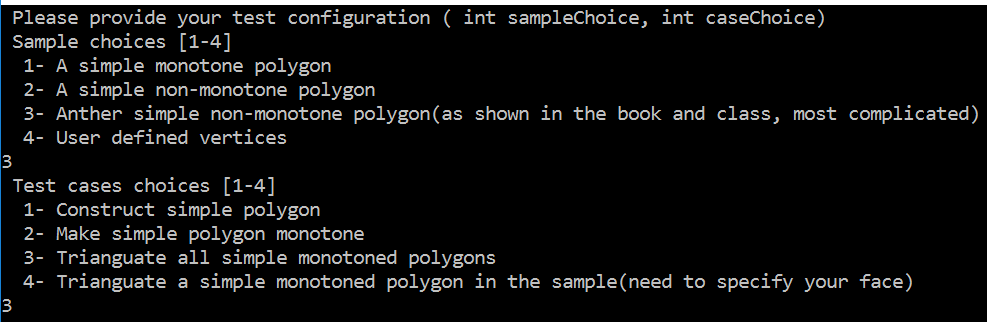

The user needs to specify two things:

-   Which sample to test (sample choice) and

-   Which case to test (case choice).

The first three samples provided are three predefined sets of vertices,
as shown below.

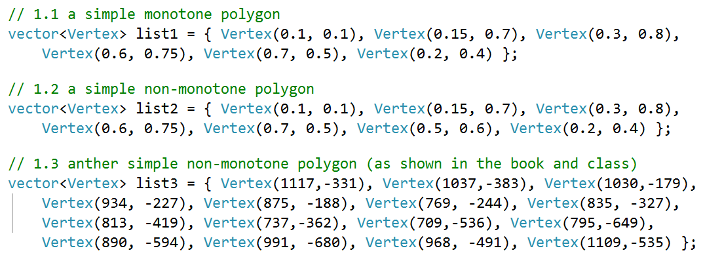

Polygon 1 Polygon 2 Polygon 3 User defined polygon

The user can choose one of them (1-3) and continue.

The four test cases are basically the implementation of

1.  Construct simple polygon from the vertices set

2.  Make a simple polygon monotone

3.  Triangulate all monotone polygons in the DCEL

4.  Triangulate a specific monotone polygon specified by the user.

For example, if the user select sample 3, and run test case 1, 2, 3
respectively, he/she will get the following display: 1.
Construct\_simple\_polygon()

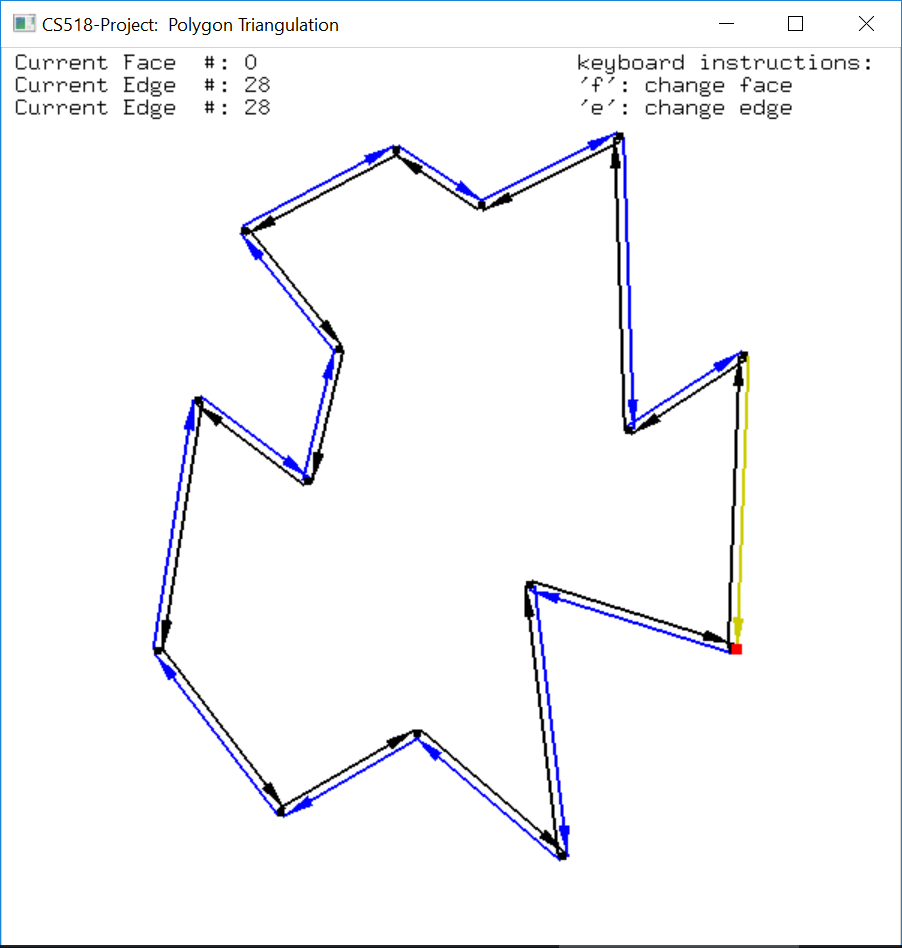

2.Make\_Monotone()

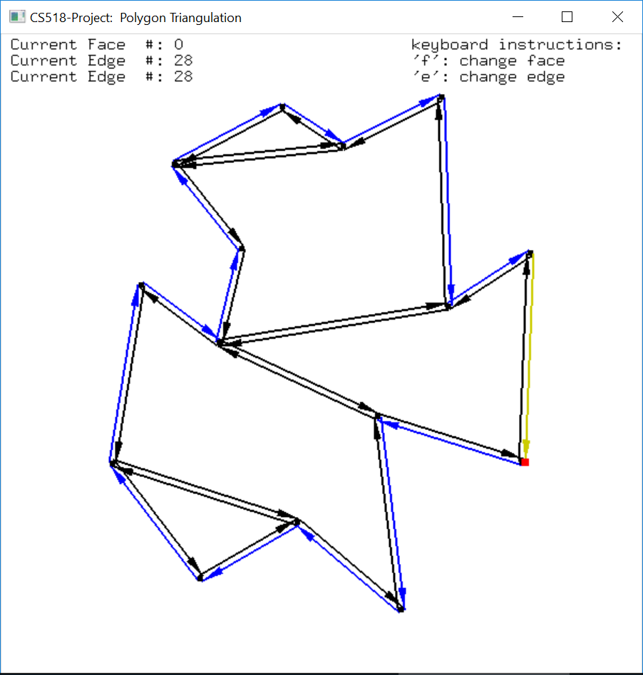

3.Triangulate\_monotone\_polygon()

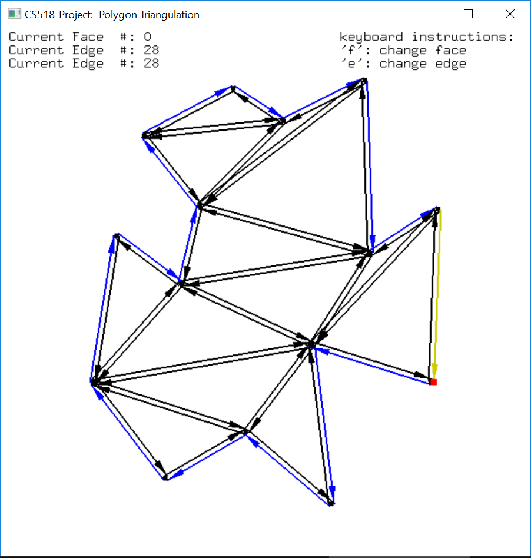

Note that the user can modify the coordinates of these vertices in the
program to test for most situations. To do this, go to the
testcases.cpp, find runTestCases() function and modify the vertices
coordinates in either of the variables list1, list2 or list3.

I have also provided a more convenient option: **the user can select
option 4 in sample choice, and provide vertices by clicking on the
screen**. Once all vertices are provided, press ‘M’ key on keyboard to
form a polygon. Keep pressing ‘M’ key would lead to “Make monotone”,
“Triangulation” and come back to “Provide vertices” step, which enables
multiple tests.

Please node if you enter any of the 4 sample choices, you cannot go back
to select another one, if you want to switch between them, please close
the program and restart.

**Point Location**

After the triangulation, the user can click on the screen which
activates the query for the location of the point. The triangle that
contains the point will be highlighted in green. The user can click
multiple times on the screen and see the results. Note, the point
location function works in all of the four sample choices. Below is an
example:

<embed src="media/image10.emf" width="241" height="231" /><embed src="media/image11.emf" width="241" height="233" />

### **Advanced user control**

In the display, each edge is represented by two arrows indicating the
two half-edges. The arrows follow the counterclockwise direction for
outer component (in black) and clockwise direction for inner component
(in blue). To switch on/off this functionality, press ‘H’ key.

There is also a yellow edge shown on the polygon. It is highlighted
where the user can move it to traverse the boundary of different faces.
To move it to the next edge, press ‘E’ key on keyboard, to change a
face, press ‘F’ key on the keyboard. The destination vertex of the
highlighted edge is shown in red.

The data of the vertices, edges and faces of the DCEL structure is
stored in three lists, one for each type. Therefore, each
vertex/edge/face has its unique location in the list, if we traverse
from the beginning of the list to the end, each item should have a
number (distance from the font node) defining its position, like an
array. This position information is showed on the top left of the
display window indicating which face/edge/vertex the current highlighted
edge is on.

Besides the GUI, the console has also shown useful information.

-   The vertices types in the method to make simple polygon monotone

    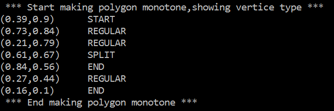

-   The vertices’ coordinates of each monotone polygon to be
    triangulated

    

-   The resulting triangulation (in terms of vertices of each face)

    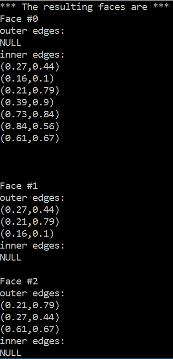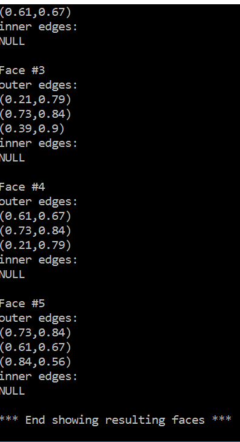

List of files included
----------------------

### Freeglut ( headers/libs/dlls )

freeglut.h, freeglut\_ext.h, greeglut\_std.h, glut.h, freeglut.lib,
freeglut.dll

### Main program

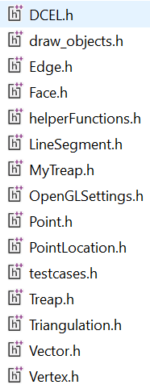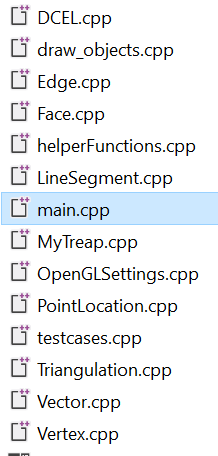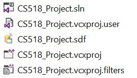

### The DCEL class (in DCEL.h and DCEL.cpp)

-   To add a vertex, use

> void add\_vertex\_at(const Vertex& v, Edge\* e); 

-   To add an edge, use

> void split\_face(Vertex\* v1, Vertex\* v2);

-   To construct a simple polygon from a set of vertices, use

> void construct\_SimplePolygon(const vector&lt;Vertex&gt;& list);

The implementation of the first two functions can be referred to the
source \[1\] and most functions in this project can be referred to the
Dr. Baca’s class notes and the book \[3\].

### The Triangulation class (in Triangulation.h and Triangulation.cpp)

-   To make a simple polygon monotone, use

> void makeMonotone( DCEL& simpleP);

-   To triangulate a monotone polygon, use

> void triangulate\_MonotonePolygon(
> DCEL& P, int nFace = 1, Face\* ptr = nullptr);
>
> where the monotone polygon is a face in P, and you either specify its
> index or provide its address in P.

-   To triangulate **ALL** monotone polygons in the DCEL, use

> void triangulate\_simple\_Polygon(DCEL& simpleP);

### The Treap class (in Treap.h, MyTreap.h and MyTreap.cpp)

To facilitate Triangulation method. I use Treap balanced binary search
tree as the underlying data structure to maintain the edge status. The
base Treap class is in Treap.h. The code is largely from the source
\[2\] and modified to fit the purpose in this project. The actual Treap
used in the project is in MyTreap.h where it implements the method to
locate an edge directly to the left of a given vertex. The detailed
implementation is in MyTreap.cpp.

1.  The PointLocation class (in PointLocation.h and PointLocation.cpp )

To find which triangle a given vertex lies in, a PointLocation class was
developed. It basically uses two binary search trees, one for the slabs,
one for the edges in a slab. Therefore, it leads to a query time
complexity of \(O(\log n)\) and space requirement of \(O(n^{2})\), where
\(n\) is the number of line segments of the planar subdivision. Due to
lack of time, the persistent search tree for the point location problem
is not implemented but can be done later.

-   To find a face that contains the vertex, use

    Face\* find\_face\_contains\_vertex(DCEL\* P,  Vertex& v);

Running Time
------------

-   The find, insert and delete operation of the Treap takes expected
    \(O(\log n)\) time. Where \(n\) is the number of edges.

-   The running time for make polygon monotone is \(O(n\log n)\) and
    uses \(O(n)\) space.

-   The running time for triangulate a monotone polygon is expected
    \(O(n\log n)\) as the Treap is used as the edge status tree. It uses
    \(O(n)\) space.

-   In summary, the triangulation can be implemented in expected
    \(O(n\log n)\) time and \(O(n)\) space.

-   The point location class has query time complexity of \(O(\log n)\)
    and space requirement of \(O(n^{2})\).

Known limitations and bugs
--------------------------

-   For the DCEL, when adding a vertex, it assumes the vertex and the
    edge it’s connecting are incident on the same face. Also, it assumes
    there is no intersection once an edge connecting the vertex
    is added.

-   For the DCEL, an edge can only be added if the two vertices defining
    it, share a face. If not, an exception is throw. To fix this, if two
    vertices does not share a face, I need to first find the
    intersection points, create vertices on those intersected edges and
    then add edges accordingly.

-   Point location class is implemented but not using a persistent
    search tree as the underlying data structure leading to higher space
    requirement \(O(n\log n) \rightarrow \ O(n^{2})\).

-   For the functions required in the project, the code runs fluently.

Credits and acknowledgments
---------------------------

\[1\] Plane graph and DCEL.
https://www.ti.inf.ethz.ch/ew/lehre/CG12/lecture/Chapter%205.pdf

\[2\] Treap data structure,
<http://iss.ices.utexas.edu/projects/galois/api/2.1/treap_8h.html>

\[3\] De Berg, M., Cheong, O., van Kreveld, M., and Overmars, M., 2008,
"Computational Geometry: Algorithms and Applications."
